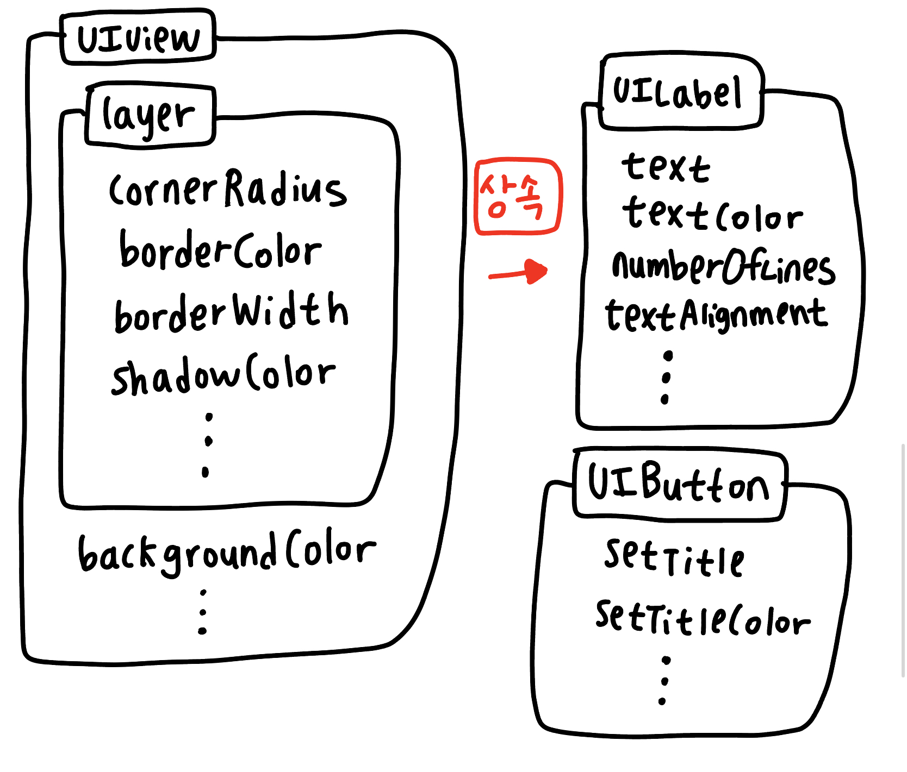
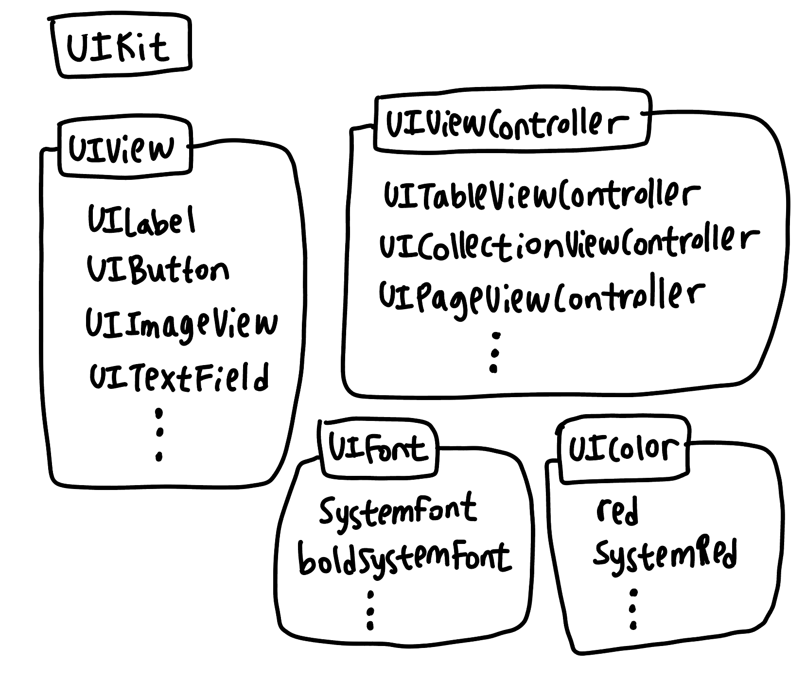

# Day 03. ViewController Subclasses & UI Components Interaction (심화)

## 1. UIViewController의 다양한 종류와 상속

모든 특수 컨트롤러는 `UIViewController`를 상속받으므로 부모의 기능을 모두 사용할 수 있다.

### ① UITableViewController (수직 목록형)

데이터를 위아래로 길게 나열하는 가장 보편적인 리스트 형태이다.

* 설정 앱(iOS Settings): 리스트가 한 줄씩 끝도 없이 이어지는 전형적인 테이블 뷰.
* 카카오톡 채팅 목록: 친구 목록이나 채팅방 리스트처럼 같은 형식의 정보가 반복되는 화면.
* 시계 앱(알람): 알람 시간들이 세로로 나열된 화면.

### ② UICollectionViewController (그리드/자유 형식)

상하좌우 자유롭게 배치할 수 있어서 시각적인 효과가 중요한 화면에 쓰인다.

* 인스타그램 프로필 그리드: 게시물들이 3x3 정사각 형태로 놓여 있는 화면.
* 핀터레스트: 사진들의 높이가 제각각인 '워터폴(Waterfall)' 레이아웃.
* 유튜브 홈 화면: 썸네일 영상들이 격자 형태로 배치된 구조.
* 사진 앱: 내 앨범 속 사진들이 바둑판 모양으로 나열된 화면.

### ③ UIPageViewController (페이지 넘김형)

책장을 넘기거나 슬라이드하는 방식의 화면이다.

* 앱 인트로/온보딩: 앱을 처음 깔았을 때 옆으로 밀어서 설명을 보는 '점 점 점'이 있는 화면.
* 이북(E-book) 앱: 실제 종이책을 넘기는 듯한 애니메이션이 들어간 화면.
* 날씨 앱: 지역별 날씨를 옆으로 넘기면서 확인하는 화면.

### ④ UISplitViewController (화면 분할형)

주로 큰 화면(iPad, Mac)에서 정보를 효율적으로 보여주기 위해 사용한다.

* 메모 앱(iPad): 왼쪽에 메모 목록이 있고, 오른쪽에는 선택한 메모의 상세 내용이 나오는 2단 구성.
* 파일 앱: 폴더 구조와 파일 내용을 한 화면에서 동시에 볼 때 사용.

### ⑤ Container View Controllers (그릇 역할)

화면의 '흐름'과 '이동'을 담당하는 관리자들이다.

* **UINavigationController(수직적 이동)**: 카카오톡에서 특정 채팅방을 눌렀을 때 화면이 오른쪽에서 왼쪽으로 밀려 들어오며 상단에 '뒤로가기' 버튼이 생기는 구조.
* **UITabBarController(수평적 이동)**: 유튜브 하단의 **홈**, **Shorts**, **구독**, **보관함**처럼 아예 다른 카테고리를 자유롭게 오가는 버튼 모음.

> "단순한 목록인가?" → **TableViewController**<br />
> "다양한 크기와 격자 형태인가?" → **CollectionViewController**<br />
> "넘기는 방식인가?" → **PageViewController**<br />

## 2. UIView와 상호작용 (User Interaction Enabled)

결국 우리가 사용하는 모든 객체는 `UIView`로부터 시작된다.<br />
사용자의 손가락을 인식할지 결정하는 User Interaction Enabled 속성은 `UIView`가 가진 가장 핵심적인 기능 중 하나다.

#### ① 계층적 영향력 (Recursive Block)

* **영향 범위**: 부모 뷰의 `User Interaction Enabled`가 꺼지면, 자식 뷰(버튼 등)의 설정이 켜져 있더라도 터치가 인식되지 않는다. 즉, 부모가 터치를 거부하면 자식도 강제로 거부당하는 **계층적 차단**이 일어난다.
* **실무 활용**: 데이터 백업이나 네트워크 통신 중에 사용자가 다른 버튼을 중복 클릭하지 못하도록 전체 뷰의 터치를 일시적으로 막을 때 유용하다.

#### ② UIImageView의 특징

* `UIImageView`는 기본적으로 이 속성이 비활성화되어 있다. 따라서 이미지에 탭 제스처를 넣고 싶다면이 속성을 활성화해야 한다.

## 3. 투명도와 레이아웃 그룹화(스택뷰)

#### ① Alpha vs Opacity

* **Alpha**: 해당 뷰와 그 안에 포함된 **모든 하위 요소(Subviews)** 까지 투명하게 만든다.
* **Opacity(배경색 설정 등)**: 하위 요소에 영향을 미치지 않고, 오직 해당 뷰의 배경색만 투명하게 만들고 싶을 때 사용한다.

#### ② Hidden과 UIStackView

* **isHidden**: 객체를 보이지 않게 하지만, 레이아웃 상의 영역은 그대로 유지한다.
* **UIStackView**: 여러 뷰를 한 방향으로 묶어주며, 스택뷰 내부 요소에 `hidden`을 적용하면 영역이 자동으로 사라지고 다른 요소가 빈자리를 채운다. (예: 카카오톡 상태 메시지 유무에 따른 이름 위치 자동 조정) **최고의 기능!!!!!👍**

#### ③ StackView의 위치와 AutoLayout의 중요성

스토리보드에서 스택뷰를 배치하고 실행하면 좌측 상단(0, 0)에 위치하게 된다.

* **이유**: `UIStackView`는 일반 뷰와 달리 본질적인 콘텐츠 크기(Intrinsic Content Size)가 스스로 정해지지 않는 **레이아웃 전용 컨테이너**이기 때문이다. 안에 아무것도 없을 때는 크기가 0이고, 내용물이 들어가도 "이 뭉치를 화면 어디에 둘 것인가"에 대한 정보가 없다.
* **오토레이아웃 설정**: 따라서 "이 스택뷰 뭉치를 화면 중앙에 둘 것인지", "위에서 얼마나 띄울 것인지"에 대한 **바깥쪽 제약 조건(Constraints)** 을 반드시 주어야 한다. 그래야 시스템이 스택뷰의 좌표를 계산할 수 있다.

## 4. Xcode 개발 환경의 이해 및 프로젝트 구조 관리 (중요!)

#### ① Cocoa Touch Class 활용

* `Swift File`은 빈 도화지이지만, `Cocoa Touch Class`는 상속받을 클래스(UIViewController 등)를 선택하면 기본 코드(BoilerPlate)를 자동으로 생성해주어 훨씬 편리하다.

#### ② 파일 위치를 바꾸면 안 되는 이유

* **참조 방식**: Xcode는 파일을 물리적으로 소유하는 게 아니라, 파일이 어디 있는지 경로(Path)를 기억하고 있다.
* **주의사항**: Xcode 밖(Finder)에서 파일 위치를 옮기면 Xcode는 파일을 찾지 못해 이름이 빨간색으로 변하며 에러가 난다. 웬만하면 프로젝트 내부 폴더 구조를 유지하는 것이 권장된다.

#### ③ Group(노란색) vs Folder(파란색)

* **Group(노란색 아이콘)**: Xcode 내에서만 분류된 '가상 폴더'이다. 파인더의 실제 경로와 일치하지 않아도 된다.
* **Folder(파란색 아이콘)**: 실제 컴퓨터의 폴더와 1:1로 매칭된다.
* **권장 방식**: 폴더 안에 폴더를 만들어 관리하는 것을 권장하며, 상황에 따라 **'Convert to Group'** 기능을 통해 폴더 참조를 Xcode 그룹으로 변환하여 개별 파일을 관리하기도 한다.

## 5. @IBOutlet vs @IBAction

#### ① 주요 차이점

* **@IBOutlet**: 뷰 객체를 코드로 가져온 **변수**다. 스토리보드에서 할 수 없는 디자인(모서리, 테두리 등)을 제어할 때 사용한다. "저 버튼의 이름을 loginButton이라고 부르고, 배경색을 바꿔야지!" 할 때 사용한다.
* **@IBAction**: 사용자가 특정 행동을 했을 때 실행되는 **기능(함수)** 이다. "저 버튼이 눌리면 이 코드를 실행해!" 할 때 사용한다.

## 6. ViewController LifeCycle: viewDidLoad

```Swift
//
//  RandomViewController.swift
//  SeSAC_260102
//
//  Created by Hyojung Jang on 1/2/26.
//

import UIKit

class RandomViewController: UIViewController {

    @IBOutlet var resultLabel: UILabel!
    @IBOutlet var checkButton: UIButton!

    let bigNumber = Int.random(in: 1...300)
    let list = ["감태", "미역", "고양이", "개미", "하이브리드"]

    // ViewController LifeCycle
    // 화면이 사용자에게 보이기 직전에 실행되는 기능
    // 초기에 세팅하면 좋을 디자인들을 구성하는 영역: 모서리 둥글기, 그림자 등
    override func viewDidLoad() {
        super.viewDidLoad()
        print("viewDidLoad")
    }
}
```

### ViewController의 생명주기는 크게 3~4단계로 나뉜다.

1. **loadView**: 뷰 생성 단계(뷰를 메모리에 올리는 중).
2. **viewDidLoad**: [현재 단계] 메모리에 로드 완료! 하지만 아직 사용자 눈에는 안 보임. 도화지가 준비되었으니 초기 디자인(둥근 모서리 등)을 하기에 가장 좋은 시점.
3. **viewWillAppear**: 화면이 나타나기 직전(눈을 뜨기 직전).
4. **viewDidAppear**: 화면이 완전히 나타난 상태(눈을 완전히 뜸).

## 7. Layer 속성과 계층 구조 (UIView vs CALayer)

`layer`는 실제 그림을 그리는 일꾼이다. `layer`는 `CALayer`라는 객체를 의미한다. 그리고 이 `CALayer`는 **모든 레이어의 조상**이다. 특별한 효과를 내기 위해 `CALayer`를 상속받아 기능을 확장한 **특수 레이어들이 존재**한다.

우리가 사용하는 모든 `UIView` 계열(UILabel, UIButton 등)이 기본적으로 이 **'기본형 CALayer'** 를 하나씩 품고 있다.

* **상위 계층(UIView)**: 터치 인식, 레이아웃 관리 등 '두뇌' 역할.
* **하위 계층(CALayer)**: 테두리, 그림자, 모서리 곡률 등 실제 '그림' 그리기 역할.
* **Layer 속성을 가진 아이들**: `UILabel`, `UIButton`, `UIImageView`, `UITextField` 등 거의 모든 UI 객체는 `UIView`를 상속받기 때문에 `layer` 속성을 가지고 있다.
  * 주의: `layer.borderColor` 등에 값을 넣을 때는 `UIColor`를 `cgColor`로 변환해서 박스에 담아주어야 한다.

### 모든 `UIView`는 내부적으로 `CALayer`를 하나씩 품고 있다.

이 둘의 관계를 조금 더 명확하게 들여다 보자.

#### 1. 껍데기와 알맹이의 관계

* **UIView(껍데기/관리자)**: 화면에서 보는 '뷰' 객체 그 자체다. 하지만 얘는 직접 그림을 그리는 능력은 없고, "여기에 터치가 일어났나?"를 감시하거나 "자식 뷰들을 어디에 배치할까?"를 결정하는 **관리자** 역할을 한다.
* **CALayer(알맹이/실행원)**: `UIView` 안에 쏙 들어가 있는 실제 **'그림판'** 이다. 테두리를 긋거나, 모서리를 깎거나, 그림자를 넣는 등의 실제 시각적인 작업은 이 레이어가 담당한다.

#### 2. 왜 `UIView` 안에 `CALayer`가 있을까?

컴퓨터 입장에서 '화면에 그림을 그리는 작업'은 꽤 무거운 작업이다. 그래서 역할을 분담한 것이다.

* **UIKit 계층(`UIView`)**: 개발자가 다루기 편하게 만들어진 고수준 도구이다. 터치 이벤트 같은 복잡한 논리를 처리한다.
* **Core Animation 계층(`CALayer`)**: GPU(그래픽 처리 장치)를 활용해 화면을 아주 빠르게 그려내는 저수준 도구다.

#### 3. 코드로 확인하는 관계

우리가 코드에서 `view.layer`라고 치는 순간, "이 뷰(UIView)가 관리하고 있는 그 레이어(CALayer) 좀 가져와 봐!"라고 명령하는 것과 같다.

* **UIView의 일**: `view.backgroundColor = .red` (배경색 바꾸는 정도는 사장님이 직접 함)
* **CALayer의 일**: `view.layer.cornerRadius = 10` (모서리를 정교하게 깎는 건 일꾼인 레이어에게 시킴)




## 8. 변수의 스코프

* **Local(함수 내부)**: 버튼을 클릭할 때마다 생기고, 중괄호가 끝나면 사라진다.
* **Instance(클래스 내부)**: 뷰 컨트롤러가 살아있는 동안 계속 유지된다. 데이터의 지속성이 필요하다면 인스턴스 영역에 선언해야 한다.