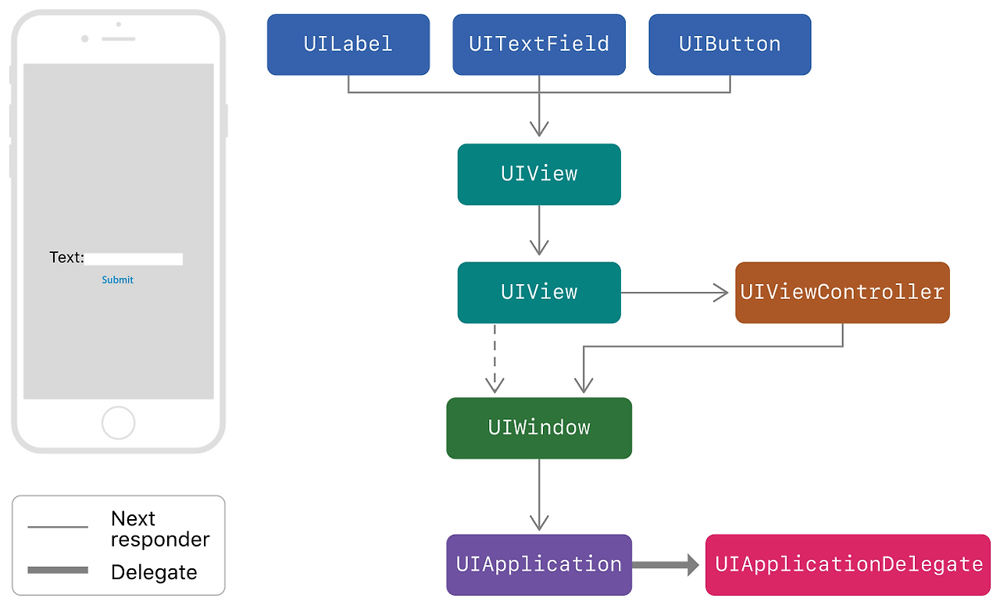

# Day 07: Responder Chain, 객체지향(Class/Struct), TableViewController

## 1. 사용자 상호작용의 흐름: Responder Chain

우리가 아이폰 유리를 터치하는 순간부터 앱이 반응하기까지는 두 가지 상반된 흐름이 동시에 일어난다.

### 탐색 단계 (Hit-Testing: 위에서 아래로)

시스템은 터치된 지점이 정확히 어떤 객체인지 찾기 위해 가장 큰 단위인 `UIWindow`부터 시작해 파고들어 간다. `UIWindow` → `UIViewController` → `UIView` 순으로 검사하며, 마지막에 가장 하위에 있는 `UITextField`를 찾아낸다. 이때 이 텍스트필드가 이벤트를 처리할 첫 번째 주인공인 **First Responder**로 낙점된다.

### 처리 단계 (Responder Chain: 아래에서 위로)

이제 주인공이 결정되었으니 거꾸로 올라오며 물어본다. 텍스트필드가 입력을 처리하지 못하거나 다음 단계로 넘겨야 할 때, 터치 이벤트는 텍스트필드 → 부모 뷰(UIView) → 뷰컨트롤러 → 윈도우 → 앱 객체 순으로 거슬러 올라간다. 이 연결 고리가 마치 체인처럼 엮여 있어 **Responder Chain**이라 부른다.

우리가 코드에서 사용하는 `becomeFirstResponder()`는 이 복잡한 탐색 단계를 생략하고, 특정 객체를 강제로 체인의 시작점(주인공)으로 만드는 강력한 명령이다. 반대로 `resignFirstResponder()`는 주인공 자리를 반납하여 키보드를 내리는 역할을 한다.

**Tip**: `viewDidLoad`는 뷰가 메모리에 로드된 직후라 뷰 계층이 완벽히 화면에 나타나지 않았을 수 있다. 따라서 키보드를 확실히 올리고 싶다면 화면이 나타난 직후인 `viewDidAppear`에서 호출하는 것이 안전하다.

## 2. 집단 자료형(Grouped Data Types)의 이해

우리는 데이터를 다룰 때 하나씩 관리하기보다 여러 개를 묶어서 관리하는 것이 훨씬 편하다는 것을 배웠다. 이렇게 여러 데이터를 하나로 묶는 모든 타입을 **집단 자료형**이라는 큰 범주로 볼 수 있다. 여기에는 크게 **컬렉션 타입**과 **튜플**이 포함된다.

### 컬렉션 타입 (Collection Types)

* **종류**: Array, Dictionary, Set
* **특징**: 이들은 공통적으로 애플이 만든 `Collection` 프로토콜을 따른다.
* **왜 컬렉션 타입인가?**
  * 프로토콜(규칙)을 따르기 때문에 동적으로 크기가 늘어나거나 줄어들 수 있다.
  * `count`, `isEmpty`, `indices` 같은 공통된 기능을 사용할 수 있고, `for in` 루프를 통해 내부를 순회하기 쉽다.
  * 즉, **대량의 데이터를 체계적인 규칙에 따라 담는 전문 바구니**라고 이해하면 된다.

### 튜플 (Tuple)

* **특징**: 집단 자료형에 속하긴 하지만, 컬렉션 타입은 아니다.
* **왜 컬렉션 타입이 아닌가?**
  * `Collection` 프로토콜을 따르지 않는다.
  * 동적으로 크기를 바꿀 수 없고, 생성할 때 정해진 개수와 타입이 고정된다.
  * 인덱스(`.0`, `.1`)는 있지만 배열처럼 `for`문을 돌려 내용을 하나씩 꺼내기가 매우 어렵다.
* **사용 목적**: 함수에서 여러 개의 결과값을 한꺼번에 반환할 때처럼, 가벼운 일회성 데이터 묶음이 필요할 때 유용하다.

## 집단 자료형의 진화: 왜 구조체(Struct)인가?

* **각각의 배열**: 영화 제목 배열, 러닝타임 배열, 배우 배열을 따로 관리하면 순서가 어긋날 위험이 크고 관리가 힘들다.
* **튜플**: `(String, Int, String)` 형태로 반환하면 데이터를 하나로 묶을 수는 있지만, 데이터가 많아지면 인덱스(`.0`, `.1`)만 보고는 이게 제목인지 배우인지 헷갈리게 된다.
* **구조체(Struct)**: 그래서 **'식판(틀)'** 역할을 하는 구조체가 등장한다. `MovieData`라는 이름을 붙이고, `title`, `runtime` 같은 명확한 변수명(프로퍼티)을 부여해 대량의 데이터를 안전하고 가독성 좋게 관리한다.

**튜플 타입 체크 팁**: 튜플을 반환하는 함수를 쓸 때 타입이 헷갈린다면, 일단 `let value = getRandomMovie()`처럼 변수에 담아서 타입을 확인해라.

**Memberwise Initializer**(구조체의 강점): 튜플은 이름이 없어 불편하고, 클래스는 일일이 `init`을 짜야 해서 번거롭다. 하지만 구조체는 프로퍼티만 선언하면 애플이 자동으로 초기화 구문을 만들어주는 **멤버와이즈 이니셜라이저**를 지원하기 때문에 가장 쉽고 빠르게 데이터를 정의할 수 있는 도구가 된다.

정리하자면:

집단 자료형 = 데이터를 묶는 모든 것 (컬렉션 + 튜플) 
컬렉션 타입 = Collection 프로토콜을 따르는 전문 바구니 (Array, Set, Dict) 
튜플 = 프로토콜은 안 따르지만 가볍게 쓰기 좋은 일회성 묶음 

## 3. 클래스(Class)와 초기화(Initialization)

* **Memberwise Initializer**: 구조체는 프로퍼티만 선언하면 자동으로 생성자(init)를 만들어주지만, 클래스는 상속 때문에 직접 짜야 한다.

* **상속과 초기화의 책임**: 자식 클래스(예: 아메리카노)는 자신의 프로퍼티뿐만 아니라 부모(커피)의 프로퍼티까지 모두 초기화할 책임이 있다. 애플 입장에서는 이 복잡한 상속 계층을 자동으로 계산해서 생성자를 만들어주기 어렵기 때문에 클래스에선 init 작성을 강제하는 것이다.

* **Override와 Super**: 부모의 기능을 내 입맛대로 바꿀 땐 override를 쓰지만, 부모가 몰래 해두었던 중요한 작업들(예: viewDidLoad 내부 로직)을 빼먹지 않기 위해 `super.viewDidLoad()`를 꼭 호출해줘야 한다.

## 4. 테이블뷰(TableView)의 재사용 매커니즘

* **컨베이어 벨트 방식**: 1,000개의 데이터가 있어도 화면에는 10개 남짓의 셀만 존재한다. 위로 올라가 사라진 셀을 아래에서 다시 받아 내용만 바꿔 끼우는 것이 **dequeueReusableCell**의 핵심이다.

* **IndexPath의 좌표계**: [Section, Row] 형태의 좌표를 통해 특정 셀의 위치를 정확히 짚어낸다.

* **Dynamic vs Static**: 데이터가 매번 달라지는 앱의 대부분은 Dynamic 방식을 사용하며, 이때 `numberOfRowsInSection`(개수)과 `cellForRowAt`(디자인) 메서드 구현이 필수다.

## 5. UI 디테일 팁

* **Equal Widths & Multiplier**: 기기마다 너비가 다르므로, 텍스트필드를 꽉 채우지 않고 여백을 주려면 부모 뷰와 Equal Widths를 잡고 Multiplier를 0.9(90%)로 조절하는 것이 효율적이다.

* **Optional Chaining**: `cell.textLabel?.text`에서 물음표는 해당 스타일의 셀에 레이블이 존재하지 않을 경우를 대비한 안전장치.